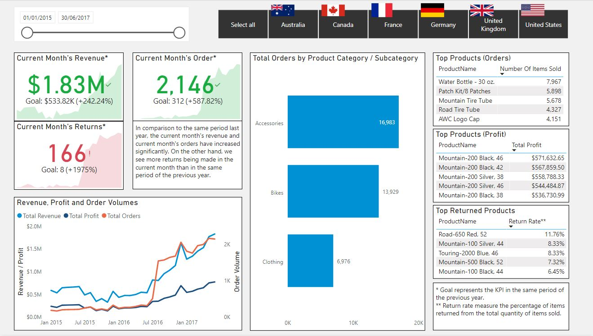

# **Sales and Product Key Performance Indicators (KPIs) Dashboard**
Sales and Product KPI Dashboard to measure the market trends for the order volume, revenue, profit and the performance of the product categories for a retail company.

## Dataset
Data is provided by Microsoft, and can be downloaded [here](https://docs.microsoft.com/en-us/power-bi/guidance/dax-sample-model).

## KPIs created:
To be updated

## Key Insights from Dashboard

1. The company has been growing in terms of Revenue, Profit and Order Volume. 
2. The USA and Australia are the largest markets for the Company, being the major sources of Revenue and Order Volume.  
