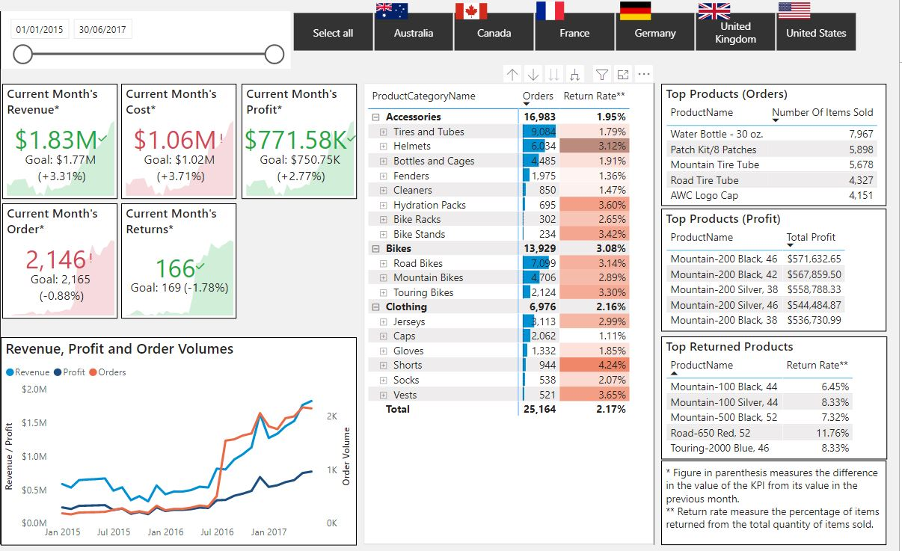
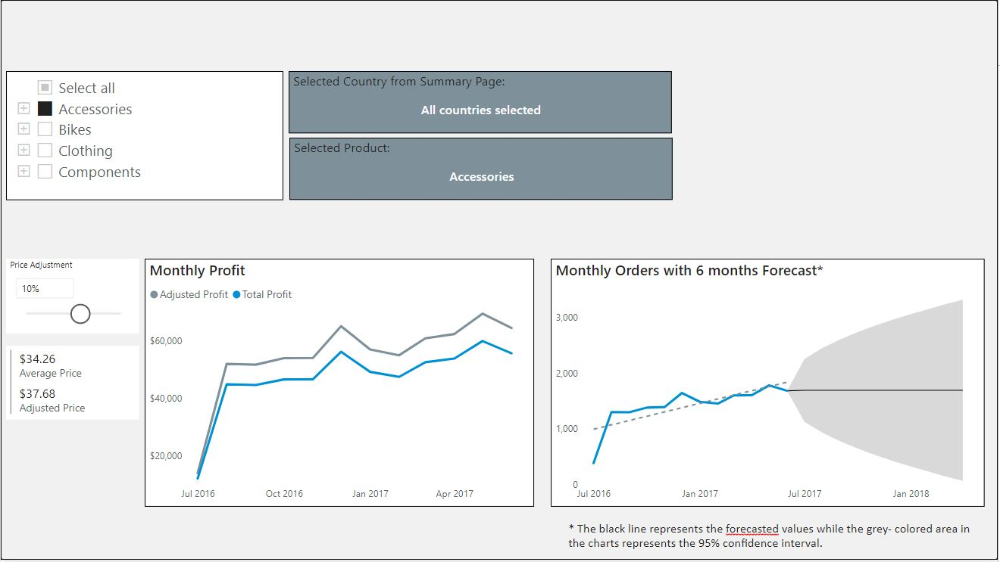

# **Sales and Product Key Performance Indicators (KPIs) Dashboard**
Sales and Product KPI Dashboard to measure the market trends for the order volume, revenue, profit and the performance of the product categories for a retail company.

## Dataset
Data is provided by Microsoft, and can be downloaded [here](https://docs.microsoft.com/en-us/sql/samples/adventureworks-install-configure?view=sql-server-ver15&tabs=ssms).

## Aim of project 
|  __Problem Statement__| __End Result__ |
| :-------------: |:-------------:| 
| To gain insights on the order volume, profit and revenue generated by the different product categories for decision making & to automate reporting.| An automated dashboard with KPIs that can be filtered by country and products (also product category and subcategory) to support data-driven decision making.|
|  __Success Criteria__| __Stakeholders__|
| Dashboard uncovering sales insights and product performance with the latest data available. | Business Development Managers, Category managers, Data Science & Analytics team, Marketing team etc.|  

## KPIs created:
To be updated

## Key Insights from Dashboard
  
**Summary Report**
1. The company has been growing in terms of Revenue, Profit and Order Volume. 
2. The USA and Australia are the largest markets for the Company, being the major sources of Revenue and Order Volume. 
3. Accessories is the category with the major source of Revenue for the company.  

  
**Product Report**
1. The effect of price change on the firm's profit can be seen for the selected product category. 
2. The order volume and its 6 months forecast for the selected products can be viewed. Multiple selection of Product categories/ subcategories/ product is allowed.